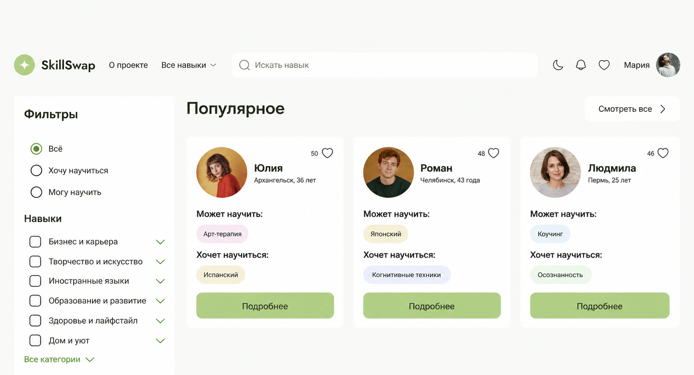
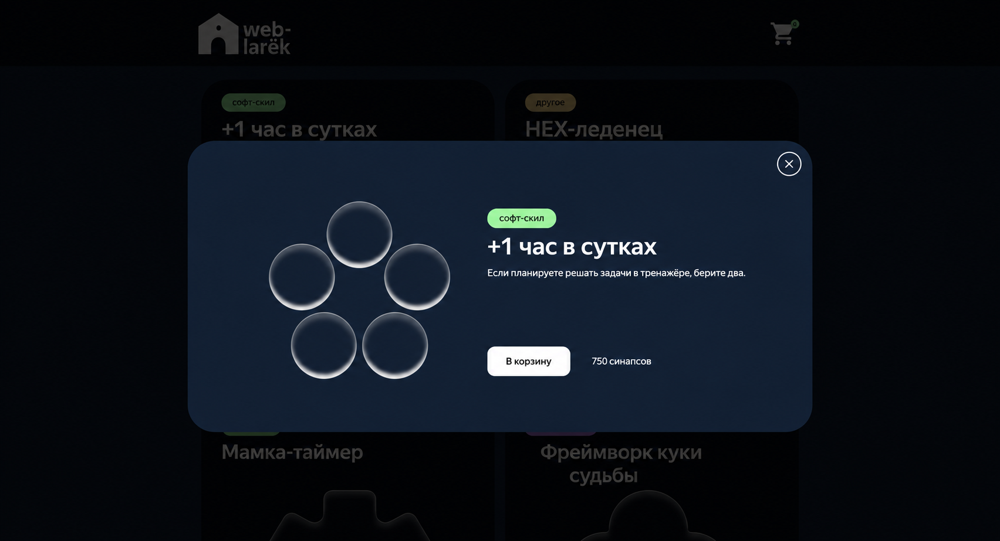

<h1>
  
  Привет, меня зовут Катя!
</h1>

Свой путь во frontend-разработке начала с самостоятельного изучения HTML и CSS по книге Элизабет Робсон, после чего поступила на курс профессиональной переподготовки по направлению «Frontend-разработчик».

Создаю понятные, адаптивные и удобные пользовательские интерфейсы. 

Сейчас нахожусь в поиске стажировки или позиции junior frontend-разработчика, где смогу применять знания на реальных задачах, перенимать опыт у коллег и профессионально развиваться.

## ✨ Обо мне
- Имею опыт командной разработки — участвовала в создании интерфейса, настройке маршрутизации и работе с Git в учебном проекте. 
- Изучаю алгоритмы по книге «Грокаем алгоритмы» и продолжаю углублять знания JavaScript, TypeScript и React.
- Активно изучаю английский язык и стремлюсь повысить уровень до B1.

#
> ### Качаю навыки во frontend с тем же упорством, с которым повышаю рабочие веса 💪

 

  

## Мой стек
<table>
<tr>
<td width="50%" valign="top">
<strong>Языки и фреймворки</strong>  

</td>
<td width="50%" valign="top">
<strong>API и данные</strong>  

</td>
</tr>
<tr>
<td width="50%" valign="top">
<strong>Тестирование и качество кода</strong>  

</td>
<td width="50%" valign="top">
<strong>Инструменты и сборка</strong>  

</td>
</tr>
</table>

## Проекты, на которых я прокачивалась

### 01 — SkillSwap
**SkillSwap** — адаптивное SPA для обмена навыками. Пользователи могут публиковать навыки, искать подходящие предложения и отправлять заявки.

  

**Мой вклад:** участвовала в командной разработке интерфейса с нуля, настройке маршрутизации и работе с мок-данными.

**Стек:**
`HTML` `CSS` `JavaScript` `React` `React Router` `Git`

---

### 02 — Web-ларёк
**Web-ларёк** — интернет-магазин с каталогом товаров, корзиной и оформлением заказа.

  

**Мой вклад:** реализовала архитектуру приложения, работу с данными, TypeScript-типизацию и взаимодействие с REST API.

**Стек:**
`JavaScript` `TypeScript` `REST API` `ООП` `Vite`

---

### 03 — Закрывающий тег
**Закрывающий тег** — адаптивная страница по макету Figma с несколькими цветовыми темами, анимациями и интерактивными элементами.

**Мой вклад:** реализовала адаптивную вёрстку, переключение темы, анимацию кнопок и модальное окно.

**Стек:**
`HTML` `CSS` `SVG` `Адаптивная вёрстка` `CSS-анимации`

## Контакты

  

